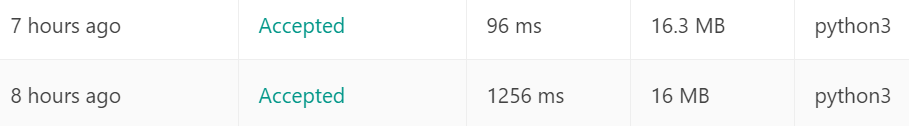

# 136. Single Number
Given a non-empty array of integers, every element appears twice except for one. Find that single one.

Note:

Your algorithm should have a linear runtime complexity. Could you implement it without using extra memory?

Example 1:

> Input: [2,2,1]  
Output: 1

Example 2:

> Input: [4,1,2,1,2]  
Output: 4

---
## Solutions
1. Using extra space
尽管题目要求不使用额外内存，但上手时最直观的算法，莫过于使用额外的容器做标记了。  
我用多了一个`list`，遍历`nums`中元素，若`list`中无该元素，则`append`，否则在`list`中删除之。
不过显然，本算法思路简单，性能极度糟糕。

2. XOR
恰巧最近学习了physical layer in computer network，受到信道复用技术**CDMA**的启发，思考从**bit**层面进行运算。  
进而想到了**XOR异或**。  
由于$$A XOR A =0$$,且异或运算满足交换律，所以对给定的`nums->list`中元素进行遍历异或，就会像**连连看**一样将其中成对的元素消除。

> 两算法的运行效率——高下立判
> 