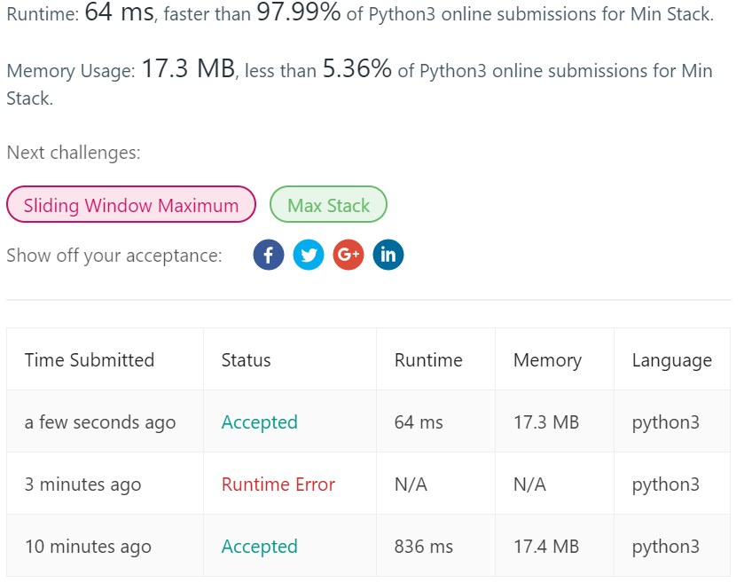

# 155. Min Stack

Design a stack that supports push, pop, top, and retrieving the minimum element in constant time.

push(x) -- Push element x onto stack.
pop() -- Removes the element on top of the stack.
top() -- Get the top element.
getMin() -- Retrieve the minimum element in the stack.
 

Example:

> MinStack minStack = new MinStack();  
minStack.push(-2);  
minStack.push(0);  
minStack.push(-3);  
minStack.getMin();   --> Returns -3.  
minStack.pop();  
minStack.top();      --> Returns 0.  
minStack.getMin();   --> Returns -2.

---
## Solutions
1. 直接使用`list`
python中`list`一直涵盖了**stack**的全部功能。所以，上来就先试试直接使用`list`，重新封装为`Minstack`类。
其中，关于求最小值`getMin()`，也偷懒的直接调用`min()`实现。  
当然，`min()`大约是要O(n)的时间复杂度——遍历无序的栈，因而此方法构建的栈在面对经常查询最小值时，性能极差。
2. 将`minimum`设置为类的属性
这也很intuitive，我们在`push()/pop()`时维护`minimum`，查询最小值时直接`return minimum`即可。
性能对比是直观的。
    > 
3. further more
在discuss中，看到了更多的方式，如入栈的不仅是push的值，而是将该值和当前最小值组成`[num,cur_min]`的形式，等等。