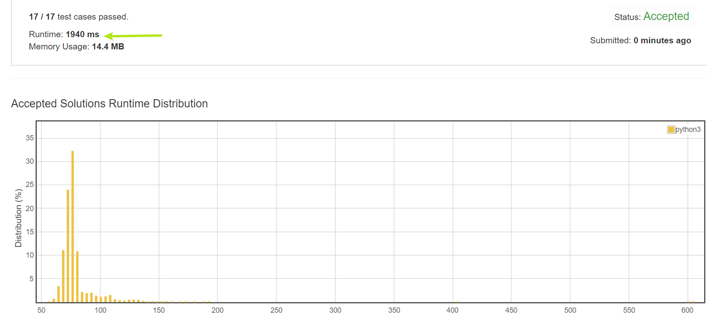

# 167. Two Sum II - Input array is sorted

Given an array of integers that is already sorted in ascending order, find two numbers such that they add up to a specific target number.

The function twoSum should return indices of the two numbers such that they add up to the target, where index1 must be less than index2.

Note:

- Your returned answers (both index1 and index2) are not zero-based.
- You may assume that each input would have exactly one solution and you may not use the same element twice.
Example:

> Input: numbers = [2,7,11,15], target = 9  
Output: [1,2]  
Explanation: The sum of 2 and 7 is 9. Therefore index1 = 1, index2 = 2.

---
## Solutions
1. 极致暴力  
要在`list`中找目标元素的下标？用`list.index()`啊！  
啥，不存在时会抛出异常？直接catch掉啊哈哈哈。  
当然，用上异常处理的算法👈性能就别想了，放上来供大家欢乐一下。
    > 
                                                                                                                
2. 二分查找  
既然给出列表有序，那我们可以设计一个**O(nlogn)**的算法：  
遍历列表元素，对于`num[i]`，我们在`numbers[i+1:]`的区间使用**二分查找**来寻找`target-num[i]`是否存在。  
二分查找的实现，调用了python的`bisect`包。

3. 老调重弹：one-pass hash map  
和无序版本的TwoSum一样，使用`dict`来构建映射。

4. 头尾双指针  
对于有序列表，我们可以使用双指针`left`，`right`来分别指向列表头尾。当两元素和小于`target`时，`left+=1`，大于时，`right-=1`，由于一定有解，故无须担心异常。
> 注意，实现此算法的时候有点小**tricky**
> 在循环中的分支判断，请遵循**加速大概率事件**，即将相等的情况最后判断，不等的情况前置。
>（仅就理论上而言。在leetcode上测试时Runtime相同）
```python
            if numbers[left] + numbers[right] > target:
                right -= 1
            elif numbers[left] + numbers[right] < target:
                left += 1
            else:
                return [left + 1, right + 1]
```
 
      
