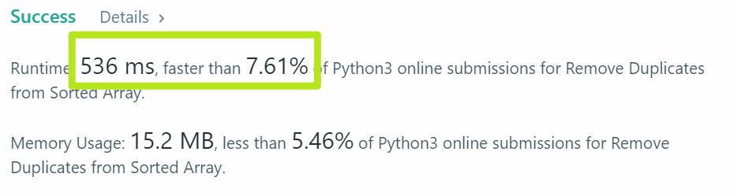

# 26. Remove Duplicates from Sorted Array

Given a sorted array nums, remove the duplicates in-place such that each element appear only once and return the new length.

Do not allocate extra space for another array, you must do this by modifying the input array in-place with O(1) extra memory.

Example 1:

> Given nums = [1,1,2],  
Your function should return length = 2, with the first two elements of nums being 1 and 2 respectively.  
It doesn't matter what you leave beyond the returned length.

Example 2:

> Given nums = [0,0,1,1,1,2,2,3,3,4],  
Your function should return length = 5, with the first five elements of nums being modified to 0, 1, 2, 3, and 4 respectively.  
It doesn't matter what values are set beyond the returned length.  
Clarification:  
Confused why the returned value is an integer but your answer is an array?

Note that the input array is passed in by reference, which means modification to the input array will be known to the caller as well.

Internally you can think of this:
> // nums is passed in by reference. (i.e., without making a copy)  
int len = removeDuplicates(nums);  
// any modification to nums in your function would be known by the caller.  
// using the length returned by your function, it prints the first len elements.  
for (int i = 0; i < len; i++) {  
    print(nums[i]);  
}

---

## solution
一道看起来很简单，思路清晰明了的题。没想到自己采坑了。

先来一个wrong version:
```python
    def removeDuplicates(self, nums: List[int]) -> int:
        detection={}
        for num in nums:
            if num in detection:
                nums.remove(num)
            else:
                detection[num]=1
        return len(nums)
```
没想到，当执行`nums.remove(num)`后，`for num in nums`自动取的`num`为下一个数值，即面对`[1,1,1,2]`时，返回的结果是`[1,1,2]`。 

于是第二版本，用下标来操作。没想到效率奇低😂。
> 

重新读题，参考别人代码，发现了两个制约时空效率的点
> 1. 调用List.remove()相当耗时  
> 2. 传入数组已然**有序**，故无须用**dict**做历史记录

于是向效率屈服，有表达不是很*pythonic*的version 3