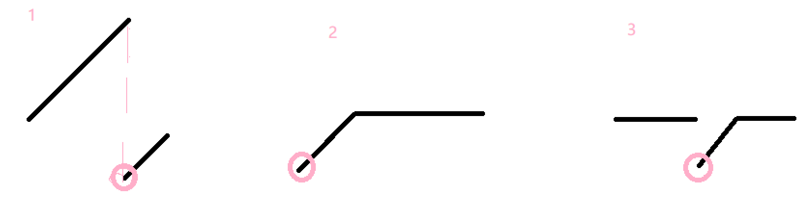

# 11_MinNumberInRotatedArray

## 题目描述
把一个数组最开始的若干个元素搬到数组的末尾，我们称之为数组的旋转。
输入一个非递减排序的数组的一个旋转，输出旋转数组的最小元素。
例如数组{3,4,5,1,2}为{1,2,3,4,5}的一个旋转，该数组的最小值为1。
NOTE：给出的所有元素都大于0，若数组大小为0，请返回0。

## 思路
测试驱动。考虑**数组旋转**的可能情况：（例子见代码末）
1. 空数组
2. 正常旋转数组
3. 旋转0个元素，即维持非递减排序的数组
4. 旋转后首尾值相同

解1：  
很自然可以通过遍历，$O(n)$的复杂度找到最小值。注意处理3、4特殊情况。

解2：  
二分查找的应用。

- 对于图中情况1，即一般情况，数组分为前后两个**有序子数组**，二分查找。  
出口条件：`left+1=right` 收敛到两数组边界  

- 情况2，单独处理，检测首尾值大小即可。

- 情况3：取`mid`后无法判断`mid`属于哪个子数组，此时只能退化为顺序查找。

## Solution
``` python
# solution1
# -*- coding:utf-8 -*-
class Solution:
    def minNumberInRotateArray(self, rotateArray):
        # write code here
        if len(rotateArray)==0:
            return 0
        pre = minimum = rotateArray[0]
        for val in rotateArray:
            if val < pre:
                minimum = val
                break
        return minimum             
        
# solution2
# -*- coding:utf-8 -*-
class Solution:
    def minNumberInRotateArray(self, rotateArray):
        # write code here
        if not rotateArray:
            return 0
        
        # zero rotate
        if rotateArray[0]<rotateArray[-1]:
            return rotateArray[0]
        
        # common case
        left, right = 0, len(rotateArray)-1
        while left+1 < right:
            mid = left + (right - left)//2
            if rotateArray[mid]==rotateArray[left] and rotateArray[mid]==rotateArray[right]:
                right = self.in_order_search(left,right, rotateArray)
                break
            elif rotateArray[mid]>=rotateArray[left]:
                left = mid
            elif rotateArray[mid]<=rotateArray[right]:
                right = mid
            else:
                return -1 #error handling
        return rotateArray[right]
    
    def in_order_search(self, left, right, rotateArray):
        min_index = right
        for i in range(left+1,right):
            if rotateArray[i]<rotateArray[i-1]:
                min_index = i
                break
        return min_index


#t1=[]
#t2=[3,4,5,1,2]
#t3=[1,2,2,2]
#t4=[1,0,1,1,1]
```